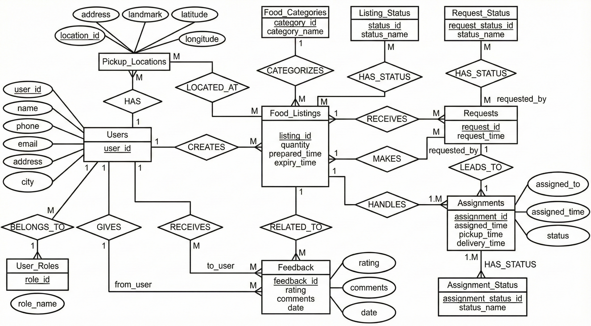

# Food Donation Management System 🍲

A full-stack food donation platform connecting donors with recipients — donors list surplus food with pickup locations, recipients browse and request it, and the system tracks assignments and feedback end-to-end.

Built as a DBMS Experiential Learning project: the focus is a **properly normalized relational design** (11-table MySQL schema in 3NF) with a Next.js application on top.

## Features

- Role-based users (donors, recipients, volunteers)
- Food listings with categories, quantities, expiry, and geo-tagged pickup locations
- Request and assignment workflow with status tracking
- Feedback system on completed donations

## Database design

The schema, ER diagram, DFDs, and normalization proof live in [`docs/diagrams/`](docs/diagrams/):



Schema is auto-applied on first run from [`init/01_schema.sql`](init/01_schema.sql) (11 tables with foreign-key constraints and cascade rules).

## Tech stack

Next.js (App Router, `src/app/api` route handlers) · MySQL 8 · Docker Compose

## Run locally

```bash
docker compose up -d      # starts MySQL 8 and applies init/01_schema.sql
npm install
npm run dev               # http://localhost:3000
```

## App routes

`/food-listings` · `/requests` · `/assignments` · `/users` · `/feedback` — each backed by REST route handlers in `src/app/api`.
